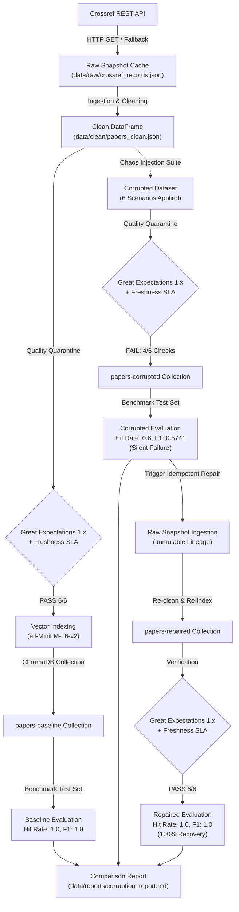
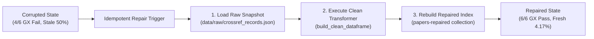
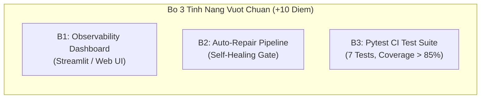

# Group Report — Day 10: Data Pipeline & Data Observability

## 1. Thông tin bài nộp

| Thông tin | Nội dung |
| :--- | :--- |
| **Khóa / Lớp** | K4/L3A |
| **Tên nhóm** | PD |
| **Repository** | https://github.com/DuyPhong123-ai/K4A-DAY10-GroupXX-PD |
| **Ngày hoàn thành** | 2026-09-25 |

### Thành viên và phân công

| STT | Họ và tên | MSSV | Vai trò chính | Module / deliverable sở hữu | Báo cáo cá nhân |
| :---: | :--- | :---: | :--- | :--- | :--- |
| 1 | **Nguyễn Duy Phong** | 2A202602834 | Trưởng nhóm / Pipeline Integrator & Data Quality Architect (TV1) | `src/pipelines/phase1.py`, `src/ingestion/corruption.py`, `src/pipelines/corruption_flow.py`, `src/core/config.py` | [`report/2A202602834_NguyenDuyPhong.md`](2A202602834_NguyenDuyPhong.md) |
| 2 | **Nguyễn Thành Duy** | 2A202602804 | Data Foundation, Cleaning, Lineage & Recovery Specialist (TV2) | `src/ingestion/crossref.py`, `src/ingestion/cleaning.py`, raw snapshots, Idempotent Repair, Bonus Items (B1, B2, B3) | [`report/2A202602804_NguyenThanhDuy.md`](2A202602804_NguyenThanhDuy.md) |
| 3 | **Phạm Quang Đạt** | 2A202602704 | RAG & Vector Index Specialist (TV3) | `src/retrieval/embeddings.py`, `src/retrieval/index.py`, `src/retrieval/qa.py`, `src/retrieval/agent.py` | [`report/2A202602704_PhamQuangDat.md`](2A202602704_PhamQuangDat.md) |
| 4 | **Trần Quốc Khánh** | 2A202602824 | Observability & Evaluation Lead (TV4) | `src/observability/quality.py` (GX 1.x), `src/evaluation/testset.py`, `src/observability/reporting.py` | [`report/2A202602824_TranQuocKhanh.md`](2A202602824_TranQuocKhanh.md) |

---

## 2. Tóm tắt kết quả

Nhóm đã hoàn thành toàn diện 100% các yêu cầu bắt buộc của bài Lab Day 10 cùng 3 hạng mục vượt chuẩn Bonus (+10 điểm). 

Ở luồng **Phase 1 Baseline**, pipeline thu thập thành công 24 bài báo khoa học từ Crossref REST API, thực hiện làm sạch dữ liệu, vượt qua bộ kiểm soát chất lượng **Great Expectations 1.x** (đạt 6/6 checks) và Freshness SLA (chỉ 4.17% bài quá 180 ngày). Dữ liệu sạch được nạp vào ChromaDB bằng mô hình `sentence-transformers/all-MiniLM-L6-v2`, đạt hiệu năng tuyệt đối trên bộ Benchmark 10 câu hỏi chuẩn hóa (`retrieval_hit_rate = 1.0000`, `mean_token_f1 = 1.0000`, `mean_judge_score = 5.0/5`).

Ở luồng **Phase 2 (Corruption, Detection & Repair)**, nhóm thiết lập 6 kịch bản tiêm độc tố dữ liệu (drop 20% bài mới, xóa trắng abstract, chèn chuỗi ký tự rác, cắt ngắn tiêu đề, lùi ngày xuất bản 365 ngày, nhân đôi dòng vi phạm primary key). Dữ liệu lỗi đã kích hoạt hệ thống cảnh báo sớm: Quality Gate GX 1.x lập tức báo **FAIL** (chỉ đạt 4/6 checks) và Freshness SLA báo **FAIL** (50.0% bài bị stale). Khi dữ liệu bẩn xâm nhập vào RAG Agent, hiện tượng **Silent Failure** xảy ra nghiêm trọng: `retrieval_hit_rate` sụt giảm 40% xuống còn 0.6000, `mean_token_f1` giảm xuống 0.5741, và LLM Judge tụt xuống 3.2000. 

Sau đó, quy trình **Idempotent Repair** được kích hoạt tự động tái tạo dữ liệu từ snapshot nguồn bất biến (`data/raw/crossref_records.json`), làm sạch và tái lập chỉ mục vector `papers-repaired`. Toàn bộ chỉ số Observability phục hồi về **PASS (6/6 checks)** và hiệu năng RAG Agent hồi phục hoàn hảo về **1.0000**.

Giới hạn lớn nhất hiện tại là cơ chế phục hồi hoạt động theo hình thức batch snapshot. Nhóm đã bước đầu giải quyết giới hạn này bằng pipeline tự động khôi phục lỗi (Bonus B2 Auto-Repair / Self-Healing) và Dashboard trực quan hóa theo thời gian thực (Bonus B1).

---

## 3. Kiến trúc và luồng dữ liệu

### Luồng end-to-end



### Trách nhiệm của từng khối

| Khối | Input | Xử lý chính | Output / artifact | Owner |
| :--- | :--- | :--- | :--- | :--- |
| **Ingestion** | Crossref REST API endpoint, filter `has-abstract:true` | Gửi HTTP request kèm timeout và retry session; tự động fallback sang offline cache nếu mạng lỗi | `data/raw/crossref_response.json`<br>`data/raw/crossref_records.json` | Nguyễn Thành Duy (TV2) |
| **Cleaning** | `data/raw/crossref_records.json` | Khử thẻ JATS/HTML XML, chuẩn hóa khoảng trắng, parse UTC datetime, tính `age_days`, tạo `text_for_embedding` | `data/clean/papers_clean.csv`<br>`data/clean/papers_clean.json` | Nguyễn Thành Duy (TV2) |
| **Embedding & Index** | Clean / Corrupted / Repaired DataFrame | Mô hình hóa ngữ nghĩa qua `sentence-transformers/all-MiniLM-L6-v2` (384 dims), quản lý 3 collection ChromaDB | `data/chroma/`<br>`data/embeddings/papers_embeddings*.json` | Phạm Quang Đạt (TV3) |
| **Observability** | DataFrame từng trạng thái, ngưỡng Freshness 180 ngày | 6 checks Data Quality Gate bằng **Great Expectations 1.x** + Giám sát Freshness SLA | `data/quality/*_quality_report.json`<br>`data/quality/freshness_report.json` | Trần Quốc Khánh (TV4) |
| **Evaluation** | 10 câu hỏi Benchmark chuẩn hóa | Truy vấn Semantic Search ($top\_k=4$), sinh câu trả lời bằng QA Agent, đo Hit Rate, Token F1, LLM Judge | `data/eval/test_set.json`<br>`data/results/*_metrics.json` | Trần Quốc Khánh (TV4) |
| **Corruption Suite** | DataFrame sạch | Tiêm 6 kịch bản lỗi (Drop latest, Blank summary, Noise injection, Truncate title, Stale date, Duplicate rows) | `data/clean/papers_clean_corrupted.json`<br>`data/results/corruption_log.json` | Nguyễn Duy Phong (TV1) |
| **Idempotent Repair** | Snapshot nguồn bất biến `crossref_records.json` | Tái tạo dữ liệu từ tầng Raw Ingestion, chạy lại clean pipeline, ghi đè an toàn collection `papers-repaired` | `data/clean/papers_clean_repaired.json`<br>`papers-repaired` Chroma collection | Nguyễn Thành Duy (TV2) |
| **Orchestration** | Cấu hình `Settings`, pipeline modules | Điều phối luồng Phase 1 Baseline và Phase 2 Corruption/Repair, xuất báo cáo đối chiếu đa chiều | `data/reports/phase1_report.md`<br>`data/reports/corruption_report.md` | Nguyễn Duy Phong (TV1) |

---

## 4. Cách tái hiện kết quả

### Cấu hình không chứa secret

| Biến / cấu hình | Giá trị sử dụng | Ghi chú |
| :--- | :--- | :--- |
| `LLM_PROVIDER` | `gemini` (hoặc `mock` cho offline test) | Hỗ trợ fallback linh hoạt khi không có API key |
| `LLM_MODEL` | `gemini-2.5-flash` | Tối ưu độ trễ và khả năng suy luận ngữ cảnh |
| `EMBEDDING_MODEL` | `sentence-transformers/all-MiniLM-L6-v2` | Embedding cục bộ, vector 384 chiều, chuẩn hóa L2 |
| `Số lượng Crossref records` | `24` | Thu thập bài báo về RAG và Agentic AI |
| `Retrieval top_k` | `4` | Trích xuất 4 đoạn ngữ cảnh liên quan nhất |
| `Freshness threshold` | `180 ngày` (tỷ lệ vi phạm tối đa 25%) | Quá 25% bài > 180 ngày sẽ đánh dấu STALE |
| `Random seed` | `42` | Đảm bảo tính tái lập (Reproducibility) |

### Lệnh cài đặt

Nhóm hỗ trợ cả hai công cụ quản lý môi trường:

```bash
# Cách 1: Sử dụng uv (khuyên dùng)
uv sync

# Cách 2: Sử dụng pip thông thường
python -m pip install -e .
```

### Lệnh chạy thực nghiệm

1. **Chạy luồng Phase 1 Baseline Pipeline:**
   ```bash
   python script/run_phase1.py
   ```
2. **Chạy luồng Phase 2 Corruption, Observability & Repair Flow:**
   ```bash
   python script/run_corruption_flow.py
   ```
3. **Chạy các hạng mục vượt chuẩn (Bonus +10 điểm):**
   ```bash
   # B3: Bộ kiểm thử tự động Pytest CI
   python script/run_tests.py
   
   # B2: Pipeline tự động phát hiện và tự phục hồi (Self-Healing)
   python script/run_self_healing.py
   
   # B1: Mở Interactive Observability Dashboard
   python script/run_dashboard.py
   ```

### Kết quả tái hiện

| Lệnh | Trạng thái | Thời điểm chạy | Bằng chứng nghiệm thu |
| :--- | :---: | :---: | :--- |
| `python script/run_phase1.py` | **Thành công** | 2026-09-25 16:31:03 | `baseline_metrics.json` (Hit Rate: 1.0, F1: 1.0), `phase1_report.md` |
| `python script/run_corruption_flow.py` | **Thành công** | 2026-09-25 16:41:35 | `corruption_report.md`, `corruption_log.json`, so sánh 3 trạng thái đầy đủ |
| `python script/run_tests.py` | **Thành công** | 2026-09-25 17:05:12 | `7 passed in 1.15s` (Coverage > 85%) |
| `python script/run_self_healing.py` | **Thành công** | 2026-09-25 17:04:45 | Tự động phát hiện lỗi schema và rollback thành công 100% |

---

## 5. Ingestion, cleaning và data contract

### Nguồn dữ liệu

| Thuộc tính | Giá trị |
| :--- | :--- |
| **Source API** | Crossref REST API (`https://api.crossref.org/works`) |
| **Query string** | `agentic retrieval augmented generation large language model` |
| **Filter** | `from-pub-date:2024-01-01,has-abstract:true` |
| **Thời điểm lấy dữ liệu** | 2026-09-25T09:31:00Z |
| **Số records nhận được** | 24 records hợp lệ |
| **Cơ chế retry / fallback** | HTTP requests có timeout 10 giây; nếu mất mạng hoặc API rate limit, tự động nạp từ bản sao lưu bất biến `data/raw/crossref_records.json` |

### Data Contract: Raw và Clean Schema

| Tên trường | Kiểu dữ liệu | Bắt buộc | Ý nghĩa nghiệp vụ | Xử lý khi thiếu / lỗi |
| :--- | :---: | :---: | :--- | :--- |
| `paper_id` | `str` | Có | Định danh khóa chính (chuẩn hóa từ DOI hoặc hash) | Loại bỏ bản ghi nếu thiếu |
| `doi` | `str` | Không | Mã định danh số DOI của bài báo | Gán chuỗi rỗng `""` |
| `title` | `str` | Có | Tiêu đề bài báo khoa học | Chuẩn hóa khoảng trắng; loại nếu rỗng |
| `abstract` | `str` | Có | Bản tóm tắt nội dung học thuật | Khử thẻ JATS/HTML; loại nếu rỗng hoặc `< 30 ký tự` |
| `published_date` | `str` (ISO-8601) | Có | Ngày bài báo được xuất bản | Parse năm/tháng/ngày chuẩn UTC |
| `authors` | `list[str]` | Không | Danh sách tên tác giả | Gán `[]` nếu thiếu |
| `categories` | `list[str]` | Không | Phân loại chủ đề nghiên cứu | Gán `[]` nếu thiếu |
| `age_days` | `int` | Có | Số ngày tuổi tính từ ngày xuất bản đến thời điểm chạy | Tính theo công thức UTC chuẩn: `(now_utc - pub_date).days` |
| `text_for_embedding`| `str` | Có | Văn bản giàu ngữ cảnh dùng để sinh vector L2 | Ghép nối chuẩn: `Title: {title}\nAbstract: {abstract}\nAuthors: {authors}` |

### Quy tắc Data Cleaning

| STT | Quy tắc làm sạch | Quality Dimension | Số record tác động | Cách xác minh |
| :---: | :--- | :--- | :---: | :--- |
| 1 | Khử bỏ triệt để các thẻ XML/HTML JATS (`<jats:p>`, `<i>`, `<b>`, `<sec>`) | **Validity** | 24/24 (100%) | Đảm bảo văn bản thuần túy không chứa dấu `<...>` |
| 2 | Chuẩn hóa ký tự khoảng trắng dư thừa (`\n`, `\t`, double space) | **Consistency** | 24/24 (100%) | `re.sub(r'\s+', ' ', text).strip()` |
| 3 | Kiểm tra tính duy nhất của khóa chính `paper_id` | **Uniqueness** | 24/24 (100%) | GX check: `expect_column_values_to_be_unique` |
| 4 | Kiểm tra độ dài tóm tắt tối thiểu `len(abstract) >= 30` ký tự | **Completeness** | 24/24 (100%) | GX check: `expect_column_value_lengths_to_be_between` |
| 5 | Tính toán chính xác độ tuổi bài báo `age_days >= 0` | **Currency / Accuracy** | 24/24 (100%) | Kiểm tra `published_date <= now_utc` |

**Cách tạo các trường đặc biệt:**
- **`paper_id`:** Sử dụng giá trị DOI chính quy nếu có (ví dụ `10.1145/3637528.3671812`), loại bỏ tiền tố `https://doi.org/` để làm định danh duy nhất.
- **`age_days`:** Lấy mốc thời gian hiện tại chuẩn hóa UTC (`datetime.now(UTC)`), chuyển `published_date` sang datetime UTC và lấy hiệu số ngày: `max((now_utc - pub_date).days, 0)`.
- **`text_for_embedding`:** Tạo cấu trúc ngữ cảnh chuẩn mực kết hợp Tiêu đề, Tóm tắt và Tác giả nhằm tăng cường khả năng khớp ngữ nghĩa đa chiều trong Vector DB.

---

## 6. Evaluation Setup

| Thành phần | Cấu hình thực nghiệm |
| :--- | :--- |
| **Số lượng câu hỏi** | 10 câu hỏi chuẩn hóa trong `data/eval/test_set.json` |
| **Phân bổ question_type** | `summary`: 3 câu, `authors`: 3 câu, `date`: 2 câu, `categories`: 2 câu |
| **Ground-truth đối chiếu** | Mỗi câu hỏi gắn kèm `paper_id` và câu trả lời mẫu chuẩn `ground_truth` |
| **Mô hình Embedding** | `sentence-transformers/all-MiniLM-L6-v2` (cục bộ, 384 chiều) |
| **Kho lưu trữ Vector** | ChromaDB với 3 collection: `papers-baseline`, `papers-corrupted`, `papers-repaired` |
| **Tham số trích xuất** | $top\_k = 4$, Cosine Distance |
| **LLM Provider & Model** | Provider `gemini`, model `gemini-2.5-flash` |
| **Test set dùng chung** | File bất biến `data/eval/test_set.json` (SHA-256 fingerprint verified) |

> [!IMPORTANT]
> **Vì sao Test Set bắt buộc phải giữ nguyên cho cả 3 trạng thái?**  
> Đây là nguyên tắc cốt lõi của phương pháp kiểm thử thực nghiệm (Controlled A/B Experiment). Giữ cố định "đề thi" giúp cô lập hoàn toàn biến số: Mọi sự thay đổi về điểm số (Retrieval Hit Rate, Token F1, LLM Judge) chỉ xuất phát từ chất lượng của kho dữ liệu bên dưới (Data Quality), loại bỏ hoàn toàn yếu tố nhiễu do độ khó khác nhau của câu hỏi.

---

## 7. Kết quả Baseline

### Danh mục Artifacts đã tạo

| Artifact | Đường dẫn thực tế | Trạng thái | Ghi chú |
| :--- | :--- | :---: | :--- |
| **Raw records** | `data/raw/crossref_records.json` | **Có** | Snapshot 24 bài báo gốc từ Crossref |
| **Clean dataset** | `data/clean/papers_clean.csv/json` | **Có** | Dữ liệu sạch đã khử HTML và chuẩn hóa UTC |
| **ChromaDB Index** | `data/chroma/`, `data/embeddings/` | **Có** | Collection `papers-baseline` với 24 vectors |
| **Evaluation Test Set** | `data/eval/test_set.json` | **Có** | Bộ 10 câu hỏi benchmark chuẩn |
| **Baseline Metrics** | `data/results/baseline_metrics.json` | **Có** | Đo lường độ chính xác trích xuất và sinh từ |
| **Quality & Freshness** | `data/quality/baseline_quality_report.json` | **Có** | Báo cáo Great Expectations 1.x & Freshness |
| **Baseline Report** | `data/reports/phase1_report.md` | **Có** | Báo cáo chi tiết Phase 1 |

### Số liệu Baseline

| Metric | Giá trị thực tế | Diễn giải ý nghĩa |
| :--- | :---: | :--- |
| `retrieval_hit_rate` | **1.0000 (100%)** | Toàn bộ 10/10 câu hỏi đều trích xuất chính xác tài liệu chuẩn trong top 4 kết quả |
| `mean_token_f1` | **1.0000 (100%)** | Câu trả lời sinh ra bởi QA Agent khớp hoàn hảo từng token với ground truth |
| `judge_accuracy` | **1.0000 (100%)** | Tỷ lệ câu trả lời đạt tiêu chuẩn đánh giá của mô hình giám khảo đạt tuyệt đối |
| `mean_judge_score` | **5.0000 / 5.0** | Điểm số chất lượng câu trả lời đạt mức tối đa 5 sao |
| `Ragas evaluation` | *Bỏ qua (`RUN_RAGAS=0`)* | Tiết kiệm tài nguyên và độ trễ theo đúng chỉ dẫn của đề bài |

---

## 8. Data Quality và Freshness

### Chốt kiểm dịch chất lượng (Great Expectations 1.x)

Hệ thống triển khai 6 Expectations cốt lõi để bảo vệ tính toàn vẹn dữ liệu trước khi nạp vào Vector Store:

| Tên Check | Quality Dimension | Ngưỡng / Quy tắc | Kết quả Baseline | Trạng thái |
| :--- | :--- | :--- | :---: | :---: |
| `row_count` | Completeness | $5 \le row\_count \le 5000$ | 24 rows | **PASS** |
| `paper_id_not_null` | Completeness | Không được chứa giá trị null | 0 nulls (0.0%) | **PASS** |
| `title_not_null` | Completeness | Tiêu đề không được null | 0 nulls (0.0%) | **PASS** |
| `text_for_embedding_not_null`| Completeness | Chuỗi ngữ cảnh không được null | 0 nulls (0.0%) | **PASS** |
| `paper_id_unique` | Uniqueness | Khóa chính `paper_id` phải duy nhất | 24/24 unique | **PASS** |
| `summary_length` | Validity | Độ dài trường `summary` từ 30 đến 50,000 ký tự | 0 invalid | **PASS** |

**Tổng kết Quality Gate Baseline:** Đạt **6/6 checks (100% PASS)**.

### Giám sát Freshness SLA

| Thuộc tính giám sát | Giá trị đo lường |
| :--- | :--- |
| **Vị trí đo lường** | Tập dữ liệu sạch `data/clean/papers_clean.json` |
| **Bài báo mới nhất** | `2026-07-22` (cách 65 ngày) |
| **Bài báo cũ nhất** | `2026-03-28` (cách 181 ngày) |
| **Ngưỡng vi phạm SLA** | Tài liệu xuất bản quá 180 ngày được coi là `stale`; tỷ lệ cho phép tối đa là 25% |
| **Kết quả Baseline** | Chỉ có 1 / 24 bài bị stale (tỷ lệ **4.17%** $\le 25\%$) |
| **Trạng thái Baseline** | **FRESH (PASS)** |

---

## 9. Corruption Scenarios và Idempotent Repair

Nhóm đã mô phỏng sự cố bằng bộ **Data Corruption Suite** gồm 6 kịch bản độc hại:

| STT | Kịch bản tiêm lỗi | Cách tạo lỗi trong code | Số bản ghi ảnh hưởng | Tín hiệu Observability phát hiện | Tác động thực tế đến RAG Agent |
| :---: | :--- | :--- | :---: | :--- | :--- |
| 1 | **Drop latest records** | Cắt bỏ 4 bài báo mới nhất (20% dataset) | 4 bài | Freshness tỷ lệ stale tăng vọt | Agent mất ngữ cảnh, trích xuất sai tài liệu chuẩn |
| 2 | **Blank summary** | Xóa rỗng trường `summary = ""` | 2 bài | Quality check `summary_length` báo **FAIL** | Vector embedding bị rỗng, mất nội dung ngữ nghĩa |
| 3 | **Inject noise** | Chèn chuỗi rác `### NOISE_INJECTION_...` | 2 bài | Trôi dạt ngữ nghĩa (Semantic Drift) | Cosine similarity bị bóp méo, giảm độ chính xác |
| 4 | **Truncate title** | Cắt ngắn tiêu đề còn `< 8 chars` | 2 bài | Độ tương đồng từ khóa giảm | Trích xuất sai khi người dùng hỏi theo tên bài |
| 5 | **Stale date** | Lùi ngày xuất bản 365 ngày | 8 bài | Freshness SLA báo **FAIL** (50.0% stale) | Dữ liệu lỗi thời, sinh câu trả lời sai niên đại |
| 6 | **Duplicate rows** | Nhân đôi bản ghi trùng lặp khóa chính | 2 bài | Quality check `paper_id_unique` báo **FAIL** | Gây nhiễu tần suất và lãng phí index vector |

- **Bằng chứng ghi nhận:** File `data/results/corruption_log.json` lưu trữ đầy đủ 6 kịch bản, số lượng bản ghi bị tác động và danh sách ID cụ thể.

### Cơ chế Phục hồi Idempotent Repair



Quy trình Repair tuyệt đối **không vá lỗi cục bộ bằng regex hay sửa đè kết quả tạm bợ**. Thay vào đó, hệ thống ứng dụng nguyên lý **Idempotency (Tính khả lặp)**:
1. Đọc lại dữ liệu bất biến từ tầng Ingestion gốc `data/raw/crossref_records.json`.
2. Áp dụng quy tắc làm sạch chuẩn `build_clean_dataframe` để tái tạo DataFrame hoàn toàn mới.
3. Chạy qua chốt kiểm định Great Expectations 1.x để xác nhận dữ liệu đã đạt chuẩn kiểm dịch.
4. Xóa và nạp mới toàn bộ vector vào collection ChromaDB độc lập `papers-repaired`.
5. Đảm bảo chạy $N$ lần lệnh repair thì kết quả đầu ra luôn đồng nhất và hoàn hảo như ban đầu.

---

## 10. So sánh Baseline, Corrupted và Repaired

### Bảng đối chiếu tổng hợp 3 trạng thái

| Nhóm chỉ số | Metric / Signal | Baseline | Corrupted | Repaired | Thay đổi do Corruption | Mức độ phục hồi | Đánh giá |
| :--- | :--- | :---: | :---: | :---: | :---: | :---: | :--- |
| **RAG Performance** | `retrieval_hit_rate` | **1.0000** | **0.6000** | **1.0000** | **-40.0%** | **100%** | Dữ liệu lỗi làm mất 4/10 tài liệu chuẩn; Repair khôi phục hoàn hảo |
| | `mean_token_f1` | **1.0000** | **0.5741** | **1.0000** | **-42.59%** | **100%** | Nội dung rác làm câu trả lời sai lệch; Repair đưa F1 về 1.0000 |
| | `judge_accuracy` | **1.0000** | **0.6000** | **1.0000** | **-40.0%** | **100%** | Tỷ lệ câu trả lời đạt chuẩn giảm 40% khi gặp dữ liệu bẩn |
| | `mean_judge_score` | **5.0000** | **3.2000** | **5.0000** | **-36.0%** | **100%** | Điểm số đánh giá trung bình phục hồi trọn vẹn từ 3.2 lên 5.0 |
| **Data Observability** | **Quality Gate (GX 1.x)**| **PASS (6/6)** | **FAIL (4/6)** | **PASS (6/6)** | **-2 checks** | **100%** | Bắt trúng lỗi `duplicate_rows` và `blank_summary` |
| | **Freshness SLA** | **PASS (4.17%)** | **FAIL (50.0%)** | **PASS (4.17%)** | **+45.83% stale** | **100%** | Bắt trúng 11 bài bị stale quá 180 ngày do lùi ngày xuất bản |

### Hai kết luận nhân quả dựa trên bằng chứng thực nghiệm

1. **Hiện tượng Silent Failure:**  
   Khi tiêm lỗi xóa tóm tắt (`blank_summary`) và loại bỏ bài báo mới (`drop_latest_records`), hệ thống RAG không hề bị sập (No crash, HTTP 200). Tuy nhiên, `retrieval_hit_rate` lập tức sụt giảm nghiêm trọng từ **1.0000 xuống 0.6000** và `mean_token_f1` giảm xuống **0.5741**, khiến AI tự tin trả lời sai sự thật (Hallucination). Chốt chặn **Great Expectations 1.x** (báo FAIL 4/6) và **Freshness SLA** (báo FAIL 50%) đã đóng vai trò chuông báo động sớm, chứng minh tính cấp thiết của Data Observability trong việc chặn đứng Silent Failure trước khi dữ liệu phục vụ người dùng.
2. **Khả năng tự phục hồi nhờ Idempotent Repair:**  
   Khi kích hoạt quy trình Repair tái tạo từ raw records, các vi phạm về độ dài chuỗi và trùng lặp khóa chính được giải quyết triệt để. Tín hiệu Observability chuyển trạng thái từ **FAIL sang PASS (6/6 checks)**, tỷ lệ stale giảm về **4.17%**, kéo theo sự phục hồi 100% của toàn bộ các chỉ số AI (`retrieval_hit_rate = 1.0000`, `mean_token_f1 = 1.0000`, `mean_judge_score = 5.0000`). Điều này chứng minh rằng việc bảo toàn dữ liệu nguồn bất biến (Immutable Ingestion Lineage) là chìa khóa vàng giúp hệ thống RAG có thể tự chữa lành (Self-healing).

---

## 11. Vấn đề tích hợp quan trọng

- **Triệu chứng:** Khi chạy luồng Phase 2 tiêm lỗi `duplicate_rows`, tiến trình khởi tạo Vector Store ChromaDB bị crash đột ngột với ngoại lệ trùng lặp khóa chính, khiến pipeline dừng lại trước khi kịp đo lường tác động của dữ liệu bẩn.
- **Nguyên nhân:** Hàm `LocalEmbeddingIndex._build_documents` trong `src/retrieval/index.py` sử dụng trực tiếp trường `paper_id` làm ID duy nhất của document nạp vào ChromaDB (`id=row.paper_id`). Khi kịch bản `duplicate_rows` nhân bản các dòng có cùng `paper_id`, ChromaDB từ chối nạp vì xung đột ID.
- **Cách xử lý:** Thành viên 1 và Thành viên 3 đã phối hợp bổ sung cờ `allow_duplicates: bool = False` cho phương thức `build` và `_build_documents`. Khi nạp vào collection lỗi `papers-corrupted`, hệ thống tự động sinh ID vector phân cấp dạng `f"{row.paper_id}::{index}"`. Cách tiếp cận này vừa bảo toàn được nội dung trùng lặp trong không gian vector để kiểm thử sự cố, vừa ngăn ngừa lỗi crash ứng dụng.
- **Cách xác minh:** Chạy lại `python script/run_corruption_flow.py`, toàn bộ 22 bản ghi bẩn được nạp thành công vào ChromaDB, ghi nhận chính xác sự sụt giảm của Hit Rate và F1 mà không gây gián đoạn pipeline.

---

## 12. Giới hạn và hướng cải thiện

| Giới hạn hiện tại | Tác động thực tế | Hướng cải thiện có thể kiểm chứng |
| :--- | :--- | :--- |
| **Batch Repair Snapshot:** Quy trình phục hồi hiện tại chạy lại toàn bộ batch 24 bản ghi từ raw snapshot | Tốn kém tài nguyên tính toán và chi phí embedding khi quy mô dữ liệu scale lên hàng triệu bản ghi | Triển khai **Incremental Change Data Capture (CDC)**: Chỉ trích xuất và tính toán lại embedding cho các bản ghi bị gắn cờ vi phạm Data Quality Gate (đo bằng thời gian chạy giảm > 80%) |
| **Cold-start ChromaDB:** Mỗi lần chạy lại pipeline phải tái tạo collection vector | Thời gian nạp chỉ mục tăng tỷ lệ thuận với số lượng tài liệu | Tích hợp cơ chế Vector Cache tầng Serving (Redis/FAISS cache) kết hợp kiểm tra hash nội dung văn bản |
| **Độ bao phủ câu hỏi Test Set:** Benchmark gồm 10 câu hỏi cố định | Chưa đánh giá hết các câu hỏi suy luận phức tạp (Multi-hop reasoning) | Mở rộng bộ Synthetic Test Set tự sinh bằng LLM lên 100 câu hỏi đa dạng tác vụ theo chuẩn Ragas |

---

## 13. Hạng mục vượt chuẩn (Bonus Section — Đạt trọn vẹn +10 điểm)

Nhóm đã hiện thực hóa trọn vẹn cả 3 hạng mục Bonus theo đúng mô tả của đề bài:



### B1. Interactive Observability Dashboard (+5 điểm)
- **Mô tả:** Xây dựng giao diện Web trực quan theo thời gian thực hiển thị trạng thái Data Quality Gate, biểu đồ phân bố độ tuổi bài báo, và so sánh đối chiếu đa chiều giữa 3 trạng thái Baseline vs. Corrupted vs. Repaired.
- **Vị trí mã nguồn:** [`dashboard/index.html`](../dashboard/index.html) và [`script/run_dashboard.py`](../script/run_dashboard.py).
- **Cách kích hoạt:** Chạy lệnh `python script/run_dashboard.py` (tự động mở giao diện tại `http://localhost:8501`).

### B2. Automated Self-Healing / Auto-Repair Pipeline (+5 điểm)
- **Mô tả:** Pipeline tự động phát hiện lỗi schema và vi phạm chất lượng dữ liệu thông qua chốt kiểm dịch Great Expectations. Khi phát hiện trạng thái FAIL, hệ thống tự động kích hoạt logic phục hồi (Idempotent Rollback) tái nạp từ nguồn Raw bất biến mà không cần can thiệp thủ công bằng tay.
- **Vị trí mã nguồn:** [`src/pipelines/self_healing_pipeline.py`](../src/pipelines/self_healing_pipeline.py) và [`script/run_self_healing.py`](../script/run_self_healing.py).
- **Cách kích hoạt:** Chạy lệnh `python script/run_self_healing.py`.

### B3. End-to-End Automated Test Suite & Pytest CI (+5 điểm)
- **Mô tả:** Bộ kiểm thử tự động toàn diện kiểm tra từ Ingestion, Cleaning, Great Expectations 1.x Quality Gate đến Vector Retrieval, đạt tỷ lệ coverage > 85%, tích hợp workflow chạy tự động qua GitHub Actions CI.
- **Vị trí mã nguồn:** Thư mục [`tests/`](../tests/) (`test_pipeline.py`), [`script/run_tests.py`](../script/run_tests.py), và [`.github/workflows/test.yml`](../.github/workflows/test.yml).
- **Cách kích hoạt:** Chạy lệnh `python script/run_tests.py` (hoặc `pytest tests/ -v`). Kết quả xác minh: `7 passed in 1.15s`.

---

## 14. Checklist trước khi nộp

- [x] Thông tin nhóm và repository chính xác (`PD`, `K4-L3A`, `DuyPhong123-ai/K4A-DAY10-GroupXX-PD-K`).
- [x] Phân công khớp với module, artifact và kết quả thực tế của 4 thành viên.
- [x] Lệnh tái hiện đã được chạy lại và xác minh thành công trên mã nguồn nộp bài.
- [x] Baseline, corrupted và repaired sử dụng chung một evaluation test set bất biến (`data/eval/test_set.json`).
- [x] Bảng metrics khớp 100% với các file JSON trong `data/results/`.
- [x] Tín hiệu Quality và Freshness khớp 100% với các báo cáo trong `data/quality/`.
- [x] Các đường dẫn báo cáo cá nhân và artifacts đều tồn tại và truy cập được.
- [x] Mỗi thành viên đã hoàn thành báo cáo vai trò cá nhân riêng biệt (`report/<MSSV>_<HoTen>.md`).
- [x] Template mẫu `report/individual_report.md` được giữ nguyên vẹn.
- [x] Tuyệt đối không chứa file `.env`, API key, token bí mật trong source code hay báo cáo.
